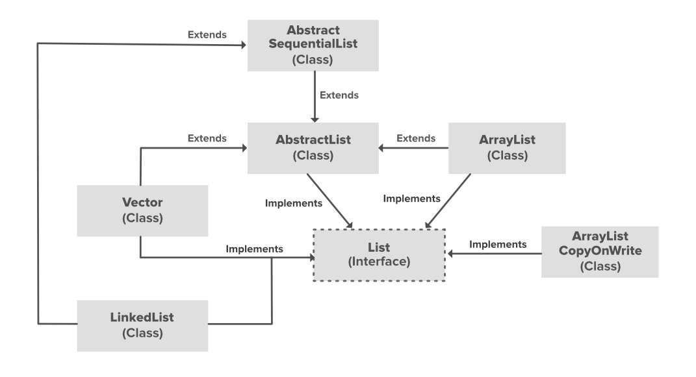

# Sorting in java

**There are two in-built methods** to sort in JAVA.

-- TimSorting 기반.  ===> **Best : O(n)** / **Worst : O(nlogn)**

1. Arrays.sort(),  원시 타입 배열에 해당되는 솔팅 

   * ``` java 
     // A sample Java program to demonstrate working of
     // Arrays.sort().
     // It by default sorts in ascending order.
     import java.util.Arrays;
       
     public class GFG {
         public static void main(String[] args)
         {
             int[] arr = { 13, 7, 6, 45, 21, 9, 101, 102 };
       
             Arrays.sort(arr);
       
             System.out.printf("Modified arr[] : %s",
                               Arrays.toString(arr));
         }
     }
     ```

2. Collections.sort(), 컬렉션에 해당되는 솔팅

   * ``` java
     // Java program to demonstrate working of Collections.sort()
     import java.util.*;
       
     public class GFG {
         public static void main(String[] args)
         {
             // Create a list of strings
             ArrayList<String> al = new ArrayList<String>();
             al.add("Geeks For Geeks");
             al.add("Friends");
             al.add("Dear");
             al.add("Is");
             al.add("Superb");
       
             /* Collections.sort method is sorting the
             elements of ArrayList in ascending order. */
             Collections.sort(al);
       
             // Let us print the sorted list
             System.out.println("List after the use of"
                                + " Collection.sort() :\n" + al);
         }
     }
     ```


## 리버스 솔팅

(1) **Arrays.sort(배열, Collections.reverseOrder())**;

(2) **Collections.sort(배열, Collections.reverseOrder())**;


## Collections.sort에 관한 정보.

``` typescript
public static void sort(List myList)

myList : A List type object we want to sort.

This method doesn't return anything
```

​																									(**List 형 구조도**)



* This class consists exclusively of static methods that operate on or return collections.  It contains polymorphic algorithms that operate on collections, "wrappers", which return a new collection backed by a specified collection, and a few other odds and ends. 

  * 결과적으로, Java.util패키지의 Collections클래스의 public static sort 메소드가 기능을 운영한다.

    ### 중요사항 

  * **All elements in the list must implement the Comparable interface. Furthermore, all elements in the list must be mutually comparable (that is, e1.compareTo(e2))**

    * 예를 들어, ArrayList안의 값이 제내릭 설정이 안돼서 다양한 타입의 Object를 품고 있다면 Comparable 하지 못하기 때문에 오류가 난다.
    * 

    **List의 값은 Comparable을 Implement한 원소이어야 하는게 또한 조건.**

    **Comparable 인터페이스는 compareTo() 메소드를 소지하며 이를 각 Class는 적절하게 오버라이딩 하였고 더불어 나가서, 사용자가 재정의해서 사용 가능하다.** 

    **궁극적으로, Collections.sort()는 Comparable<Interface>을 implement한 여러 기본형 클래스들의 오버라이딩 된compareTo()를  List의 원소에 의존하여 정렬을 진행한다.**

    
    
    * ```java
      // A Java program to demonstrate use of Comparable
      import java.io.*;
      import java.util.*;
       
      // A class 'Movie' that implements Comparable
      class Movie implements Comparable<Movie>
      {
          private double rating;
          private String name;
          private int year;
       
          // Used to sort movies by year
          public int compareTo(Movie m)
          {
              return this.year - m.year;
          }
       
          // Constructor
          public Movie(String nm, double rt, int yr)
          {
              this.name = nm;
              this.rating = rt;
              this.year = yr;
          }
       
          // Getter methods for accessing private data
          public double getRating() { return rating; }
          public String getName()   {  return name; }
          public int getYear()      {  return year;  }
      }
       
      // Driver class
      class Main
      {
          public static void main(String[] args)
          {
              ArrayList<Movie> list = new ArrayList<Movie>();
              list.add(new Movie("Force Awakens", 8.3, 2015));
              list.add(new Movie("Star Wars", 8.7, 1977));
              list.add(new Movie("Empire Strikes Back", 8.8, 1980));
              list.add(new Movie("Return of the Jedi", 8.4, 1983));
       
              Collections.sort(list);
       
              System.out.println("Movies after sorting : ");
              for (Movie movie: list)
              {
                  System.out.println(movie.getName() + " " +
                                     movie.getRating() + " " +
                                     movie.getYear());
              }
          }
  }
      ```
    
      

=====>  **상위의 동작은 위의 그림처럼 내부적으로 작동하게 된다.**


#### 생각하기

상위의 list형은 ArrayList클래스로서 그냥 Collections.sort()에 삽입해서 실행시키면 되는 거 아닌가? 왜 굳이 implements를 하는가?


**--답--**

이유는 list의 맴버 변수가 1개가 아니기 때문에 어떤 것을 정렬해야할지 정하지 못한다. 고로, Comparable을 implement하여 비교할 값을 확실히 정해줘야만 가능한 일이다.


## Comparable VS Comparator

* 공통적인 점은, 둘 다 인터페이스이며 Collections.sort()의 정렬 방법을 결정한다.

### 정의 비교 

​	(From Comparable)

**int compareTo(Object obj)** **:** This method compares this String to another Object.

​	(From Comparator)

**public int compare(Object obj1, Object obj2)**

​																					----------------------**코드**----------------------

``` java 
//A Java program to demonstrate Comparator interface
import java.io.*;
import java.util.*;
 
// A class 'Movie' that implements Comparable
class Movie implements Comparable<Movie>
{
    private double rating;
    private String name;
    private int year;
 
    // Used to sort movies by year
    public int compareTo(Movie m)
    {
        return this.year - m.year;
    }
 
    // Constructor
    public Movie(String nm, double rt, int yr)
    {
        this.name = nm;
        this.rating = rt;
        this.year = yr;
    }
 
    // Getter methods for accessing private data
    public double getRating() { return rating; }
    public String getName()   {  return name; }
    public int getYear()      {  return year;  }
}
 
// Class to compare Movies by ratings Sub기능
class RatingCompare implements Comparator<Movie>
{
    public int compare(Movie m1, Movie m2)
    {
        if (m1.getRating() < m2.getRating()) return -1;
        if (m1.getRating() > m2.getRating()) return 1;
        else return 0;
    }
}
 
// Class to compare Movies by name Sub기능
class NameCompare implements Comparator<Movie>
{
    public int compare(Movie m1, Movie m2)
    {
        return m1.getName().compareTo(m2.getName());
    }
}
 
// Driver class
class Main
{
    public static void main(String[] args)
    {
        ArrayList<Movie> list = new ArrayList<Movie>();
        list.add(new Movie("Force Awakens", 8.3, 2015));
        list.add(new Movie("Star Wars", 8.7, 1977));
        list.add(new Movie("Empire Strikes Back", 8.8, 1980));
        list.add(new Movie("Return of the Jedi", 8.4, 1983));
 
        // Sort by rating : (1) Create an object of ratingCompare
        //                  (2) Call Collections.sort
        //                  (3) Print Sorted list
        System.out.println("Sorted by rating");
        RatingCompare ratingCompare = new RatingCompare();
        Collections.sort(list, ratingCompare);
        for (Movie movie: list)
            System.out.println(movie.getRating() + " " +
                               movie.getName() + " " +
                               movie.getYear());
 
 
        // Call overloaded sort method with RatingCompare
        // (Same three steps as above)
        System.out.println("\nSorted by name");
        NameCompare nameCompare = new NameCompare();
        Collections.sort(list, nameCompare);
        for (Movie movie: list)
            System.out.println(movie.getName() + " " +
                               movie.getRating() + " " +
                               movie.getYear());
 
        // Uses Comparable to sort by year
        System.out.println("\nSorted by year");
        Collections.sort(list);
        for (Movie movie: list)
            System.out.println(movie.getYear() + " " +
                               movie.getRating() + " " +
                               movie.getName()+" ");
    }
} 
```

## SUMMARY

두 개의 오브젝트를 받아서 더욱 다양한 비교를 실현해낸다. Comparable 인터페이스 활용시 Movie Class의 Year을 비교하는 정렬을 하는 등 한 가지 elements에 대한 비교만이 가능하지만 (Overloading이 불가, 고로 Year,Name,Rate 3개중 1개 선택 제한.) Comparator 인터페이스 활용시 더 나아가 다양한 elements에 대한 비교를 만들 수 있다.  (Year를 Comparable로 만들었다면, 나머지는 Comparator로 커버가 가능하다.) 그리고, Comparator 사용  시 Collections.sort(List,Class) ===> 곧, Class가 들어가야 하므로 이들을 Comparator Implements 받아 재정의해서 입력해 줘야한다.